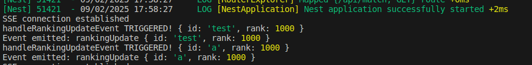
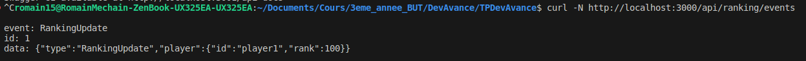

# TP de Développement Avancé

## Présentation du projet : 

Le projet consiste à réaliser une application de gestion de joueurs et de matches en fonction de leur score, le tout de manière dynamique. Nous utilisons pour cela Node.js. Notre travail consiste à mettre en place le serveur, le client quant à lui est déjà réalisé.

## Prérequis :

Avant de commencer, nous avons du mettre en place un environnement de développement. Pour cela, nous avons installé Node.js et pnpm. Nous avons également installé les dépendances nécessaires à notre projet. 

Il nous a aussi fallu trouver comment démarer le serveur ainsi que le client, il s'agit donc des commandes suivantes : 

Serveur : `pnpm run apps:server:dev`

client : `pnpm run apps:client:dev`

## Mise en places des routes : 

Tout d'abord, nous pouvions lancer la documentation de swagger pour voir les routes à mettre en place. J'ai donc remarqué qu'il y aurait 3 modules différents à mettre en place :

- Players
- Matches
- Ranking

J'ai donc commencé par mettre en place les routes pour les joueurs. Il fallait uniquement faire un POST permetant d'ajouter un nouveau joueur. Pour cela, j'ai créer dans un premier temps une classe Player qui contient les informations d'un joueur. 

Puis, dans le fichier `player.service.ts` j'ai mis en place la méthode `addPlayer` qui permet d'ajouter un joueur, celle-ci l'ajoute dans un tableau de joueurs, qui est donc gardé en cache.

Enfin, j'ai mis en place la route dans le fichier `player.controller.ts`, avec l'url corespondant à ce qui est demandé dans la documentation swagger. Elle renvoit également les informations de retours attendues, ainsi que les erreurs possibles.

J'ai ensuite fait de même pour les matches, en mettant en place une route pour ajouter un match, et enfin pour le ranking, en mettant en place une route pour récupérer le classement des joueurs.

## EventEmitter :

Pour que l'affichage du client soit dynamique, il fallait mettre en place une route Sse pour abonner le client à des évènements. Pour cela, j'ai utilisé la classe EventEmitter2. 

Pour commencé, il fallait emettre un événement à chaque fois qu'un joueur était ajouté. Dans le fichier `player.service.ts`, j'ai donc mis en place un EventEmitter qui emet l'événement 'rankingUpdate' ansi que le player en data. 

J'ai également fait de même pour les matches, en emettant deux événements, un pour chaque joueur avec le score mis à jour.

Enfin, j'ai mis en place la route Sse dans le fichier `ranking.controller.ts`. Ansi que l'écoute des événements dans le fichier `ranking.service.ts`, renvoyant les informations attendues.

Malgrès beaucoup d'essaie et de recherche, je n'ai pas réussi à rendre dynamique l'affichage du client, en effet, lorsque je fais des tests avec des curl directement dans le terminal, je recoit bien les informations sur les joueurs dans un format correct, cependant le client ne les met pas à jour.

Affichage du srveur à l'utilisation du client :

Test avec un curl : 
